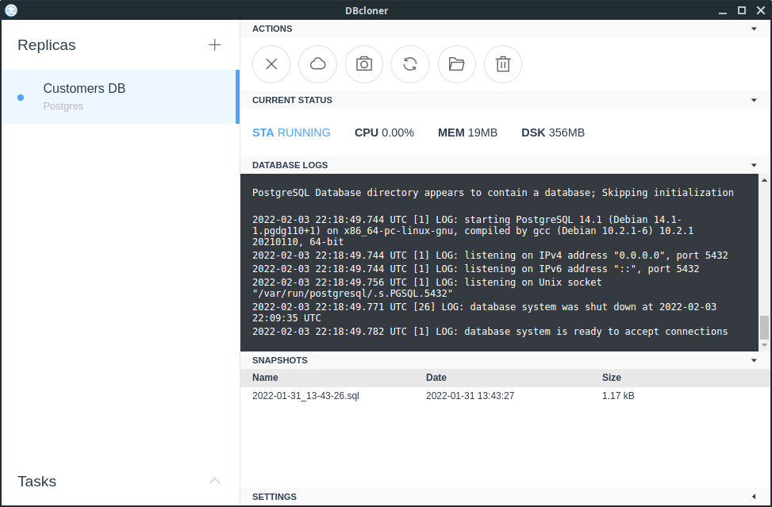

# DBcloner

DBcloner is a desktop app for cloning live remote databases in your desktop.

It works by dumping remote dbs and mounting them into docker containers that you can easily manage by taking snapshots, restoring previous states, re-syncronize from remote, etc.

Since it's Docker based, you will never ever need to deal with any database server runtime. 100% hassle-free.

DBcloner was not built with a specific use case in mind, but you can use it to make some developer experiences better, like mounting local environments, running painless dml queries, safer debugging using real data.

  

## Current state of development and roadmap

DBcloner is currently a closed source experimental project. It's being built using Vue over Electron, and [dockerode](https://github.com/apocas/dockerode) node library to communicate with the Docker API.

Only PostgreSQL is supported for the moment but MySQL and MariaDB support is almost ready for the next release.

By the moment there's no a well-established roadmap, but here are some features that I'm planning to add in the future:

- Continuous replication instead of full dump to reduce synchronizations times for bigger databases
- Support for creating replicas using only a dump file, without the need of a remote connection
- Support for NoSQL engines (MongoDB, CouchDB, etc)
- Support for cloud-only databases (AWS Aurora, DynamoDB are some candidates)

I'm open to feedback and ideas. If you want to say something feel free to open an issue or send me an email to felipe@leiva.io.